# Konnect

Konnect is a word game where the computer selects a random word and you have to guess the word in the least amount of lifelines. If you get a letter right in the right position of your guess it will turn green, orange shows the letter is right but in the wrong position and red show the letter doesn't belong in the game. This the link to the live version of the game (<https://firefox35.github.io/konnect/>)

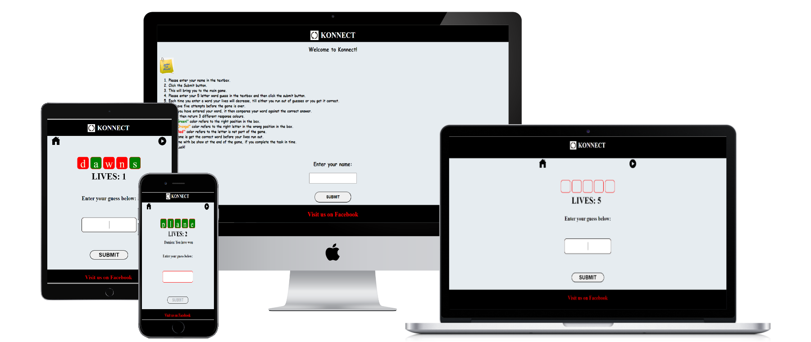

## Features

### Site Wide

## Game Instructions

- Please enter your name in the textbox.
- Your username must be more than 2 letters to be valid otherwise an alert will be displayed.
- Click the Submit button.
- This will bring you to the main game.
- Please enter your 5 letter word guess in the textbox and then click the submit button.
- Each time you enter a word your lives will decrease, till either you run out of guesses or you get it correct.
- You have five attempts before the game is over.
- Once you have entered your word, it then compares your word against the correct answer.
- It will then return 3 different response colours.
- The "Green!" colour refers to the right position in the box.
- The "Orange!"colour refers to the right letter in the wrong position in the box.
- The "Red!" color refers to the letter is not part of the game.
- If you have guessed the word correctly it will display all the letters green and your name as a winner.
- If you have run out of lives and your guess is wrong it will display the correct answer to the game.
- You can end the game by clicking the home or the play again button both will bring you back to the introduction screen.
- Good Luck!

The Rules of Game Screen
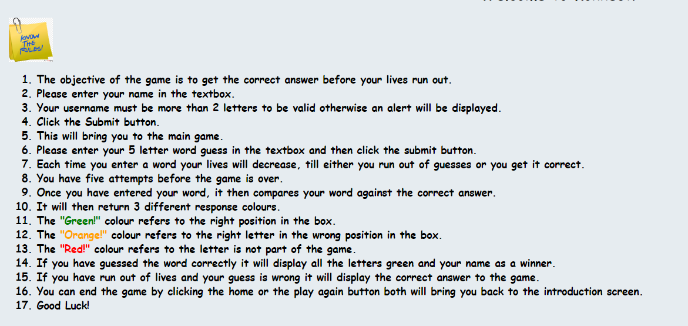

## How the Game is played.

- The user has enter a word as shown below with 4 reds and 1 yellow.
- This means the reds are wrong and the one yellow is in the wrong position but part of the word.

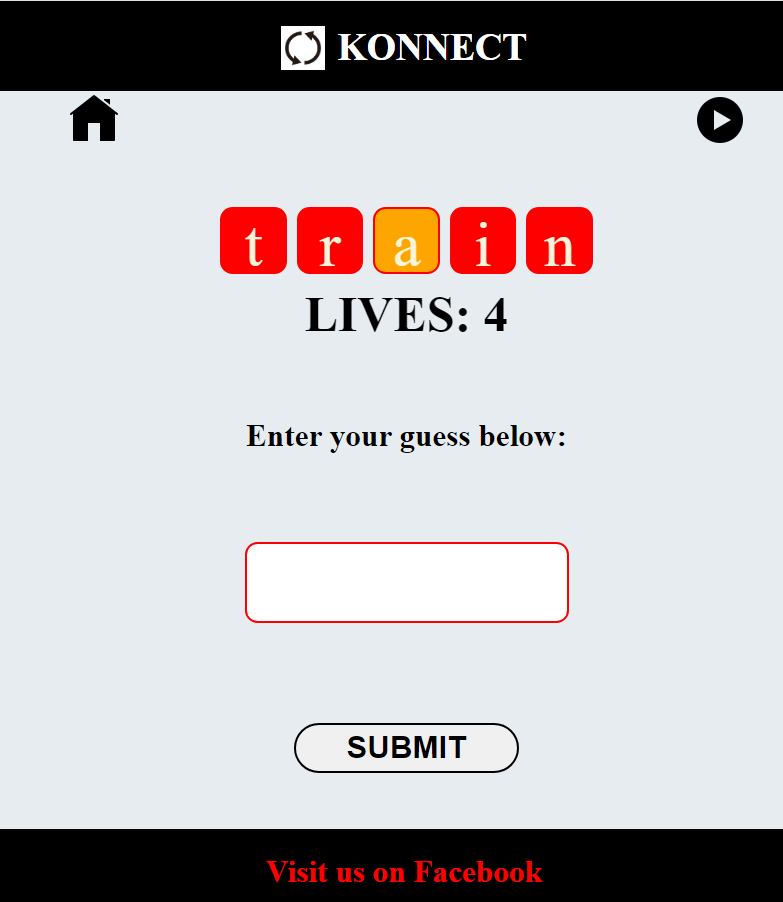

- The user has enter a word as shown below with 3 reds and 2 greens.
- This means that the reds are wrong and the 2 greens are correct and in the right position.

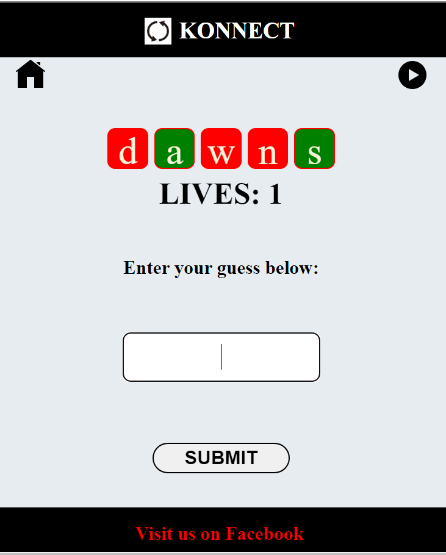

- The user has run out of lives and has the wrong answer as shown below. 
- Game Over - Try Again

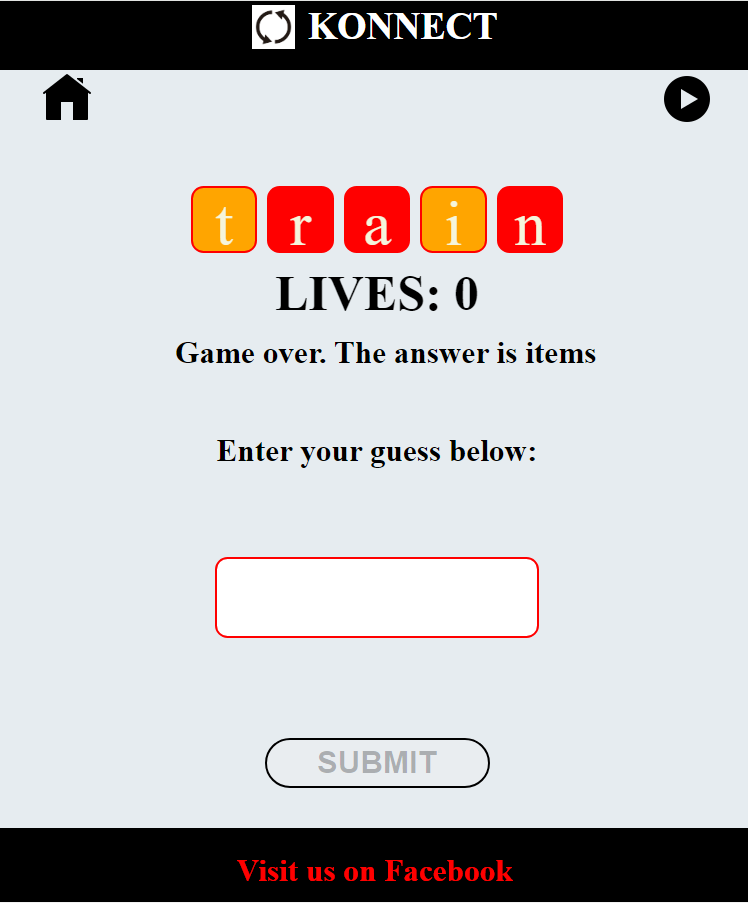

- The username is displayed that they have won the game as shown below.

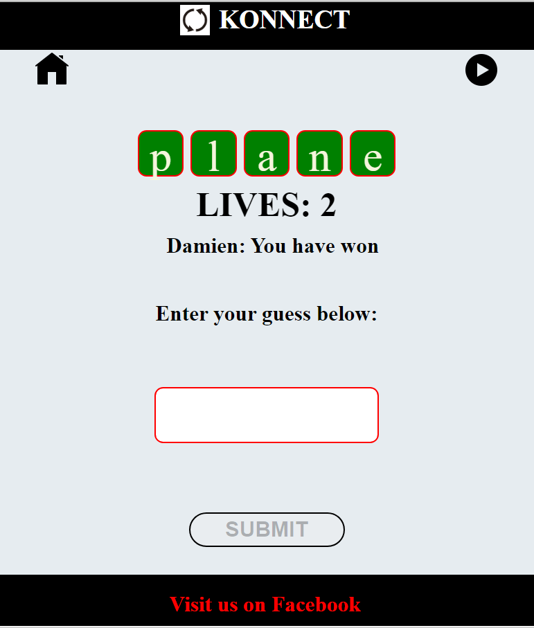

Header

- Displays the Logo and the name of the brand to promote the game.

  

Navigation Menu

- The navigation is very simple to the game, once you enter your name into the input field and click submit you will be able to enter the game.
- In the game screen there is both a house and restart button that will bring you back to the Introduction Screen.

Footer

- Displays a message to visit us on Facebook

  

Error

- Error due favicon not working.

### About Screen

- About Screen Image

  - The user is shown with an introduction of electricity flowing through the screen needed to be Konnect to the game.

- About Screen Description

  - The user is shown a screen with general rules of the game and where to enter the person and submit to enter the game.

    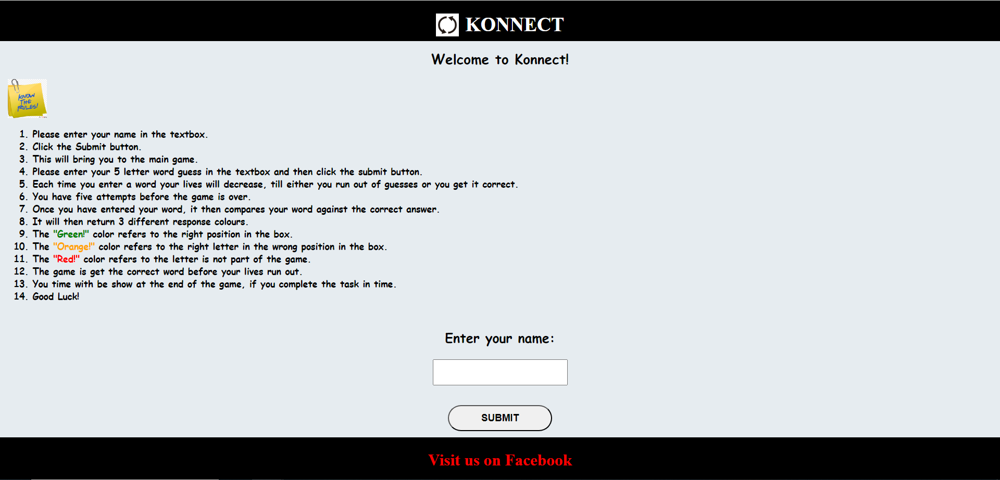

### Main Game Screen

- Game Screen Image

  - The user is shown with an image of a electrician coming to Konnect to the game as the electricity flows through the game.

- Game Screen Description

  - The user is displayed with the game as per the game rules shown in the about screen.

    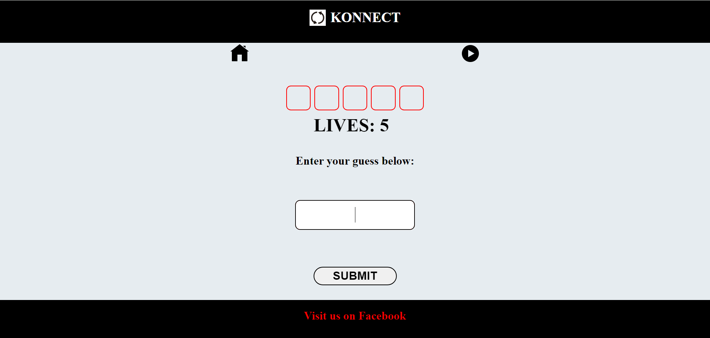

## Extra Features

Local Storage

- The user enter there name and click submit will be then stored in Local Storage.
- If you winner the game it will display the users has won with there name attached.

## Future Implementation

- I need to create a restart/reset to the game, this is currently been redirected to the Introduction Screen.
- Implementation of a Leader board.

## UX Design

Wireframes - Balsamiq

- About Screen

  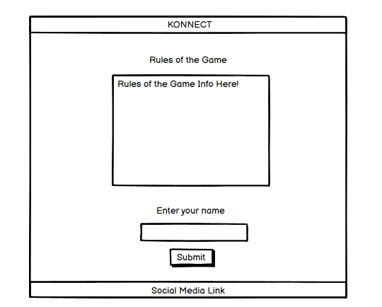

- Main Game Screen

  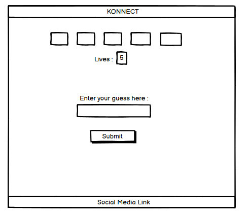

## Technologies

HTML

- Hypertext Markup Language is the main language to create the structure of the website.

CSS

- Cascading Style Sheets is used to style your content in an external file.

JavaScript

- Object Oriented programming language that interacts with the web browser.

Github

- This is used to create and store your source code as a backup if you lose your application.
- <https://github.com/firefox35/konnect>

Git

- Git is the language used to submit your source code to the repository.

CodeAnyWhere

- Is the application where you create your website in file structures.

Balsamiq

- This application was used to create mockups for the konnect website.
- <https://balsamiq.com>

Website Mockup Generator

- This application was used to create images of the konnect website in desktop, laptop, tablet and mobile devices.
- <https://websitemockupgenerator.com>

Resize images

- This application was used to resize images of the konnect website in desktop, laptop, tablet and mobile devices.
- <https://www.resizepixel.com/>

Navigation

Introduction Screen

- Submit Button : Once you fill out your first name and click the button it will bring you to the game screen.

Game Screen

- Home Button : Will bring you back to the Introduction Screen.
- Play Again : Currently will bring you back to the Introduction Screen. (This is a work in progress due to time constraints).

## Testing

Responsiveness

Responsiveness was tested on screen sizes from 320px on Chrome, Edge, Firefox and Opera browsers.

Steps to test:

1. Open browser and navigate to [Konnect](https://firefox35.github.io/konnect/)
2. Open the developer tools (right click and inspect)
3. Set to responsive and decrease width to 320px
4. Set the zoom to 50%
5. Click and drag the responsive window to maximum width

Expected:

No issues regards with overlapping, images and links

Result:

No issue to report.

Accessibility

The following criteria were met for testing.

- All navigation links accessibility
- Text or titles descriptions are visible.
- Heading level are not missed.
- HTML page attribute has been set.

Manual testing performed as expected and accessible.

### Lighthouse Testing

Konnect Screens
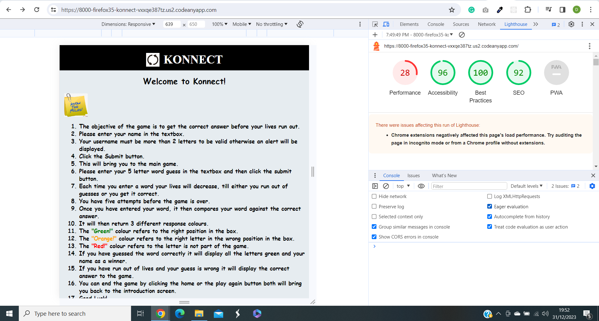

### Functional Testing

#### Navigation Links

- Perform testing was carried out on all navigation links and found to be working perfectly by way of clicking each buttons.

| Navigation   | Page to Load |
| ------------ | ------------ |
| About Screen | index.html   |
| Main Screen  | index.html   |

#### Game Testing

-The game was tested to ensure its functionality was correctly working.

-The following test scenarios were covered.

#### TEST 1 - [Konnect](https://firefox35.github.io/konnect/)

|          Description        |            Steps                             |          Expected        | Result |
|-----------------------------|----------------------------------------------|--------------------------|--------|
| Store Name in Local Storage | 1. Display of Introduction Screen.           | To submit name into local storage | &check;|
|                             | 2. Enter name in input field.                |                          |        |
|                             | 3. The input field shows the name.           |                          |        |
|                             | 4. Click Submit.                             |                          |        |
|                             | 5. The user is redirected to the Game Screen.|                          |        |
|                             | 6. The name is stored in local storage.      |                          |        |

#### TEST 2 - [Konnect](https://firefox35.github.io/konnect/)

|          Description        |            Steps                             |          Expected        | Result |
|-----------------------------|----------------------------------------------|--------------------------|--------|
| Navigate to Game Screen     | 1. Display of Introduction Screen.           | Enter into Game Screen   | &check;|
|                             | 2. Enter name in Input field.                |                          |        |
|                             | 3. The Input field shows the name.           |                          |        |
|                             | 4. Click Submit.                             |                          |        |
|                             | 5. The user is redirected to the Game Screen.|                          |        |

#### TEST 3 - [Konnect](https://firefox35.github.io/konnect/)

|          Description        |            Steps                     |          Expected         | Result |
|-----------------------------|--------------------------------------|---------------------------|--------|
| Validate Username           | 1. In the About Screen.              | Displays an Alert message.| &check;|
|                             | 2. Enter a name with 2 characters.   |                           |        |
|                             | 3. Click the Submit.                 |                           |        |
|                             | 4. Alert message is displayed.       |                           |        |
|                             | 5. Click Ok.                         |                           |        |
|                             | 2. Re-enter a correct username.      |                           |        |

#### TEST 4 - [Konnect](https://firefox35.github.io/konnect/)

|          Description        |            Steps                             |          Expected        | Result |
|-----------------------------|----------------------------------------------|--------------------------|--------|
| User guess word submitted   | 1. In the Game Screen.                       | Word should display in Output Boxes. | &check;|
|                             | 2. Enter guess word into the Input field.    |                          |        |
|                             | 3. Click Submit.                             |                          |        |
|                             | 4. Display's on Output Boxes.                |                          |        |

#### TEST 5 - [Konnect](https://firefox35.github.io/konnect/)

|          Description        |            Steps                             |          Expected        | Result |
|-----------------------------|----------------------------------------------|--------------------------|--------|
| User guess word clears when submitted | 1. In the Game Screen | Input field to become clear for next guess.| &check;|
|                             | 2. Enter guess word into the Input field.    |                          |        |
|                             | 3. Click Submit                              |                          |        |
|                             | 4. Display's on Output boxes.                |                          |        |
|                             | 5. Input field is empty                      |                          |        |

#### TEST 6 - [Konnect](https://firefox35.github.io/konnect/)

|          Description        |            Steps                             |          Expected        | Result |
|-----------------------------|----------------------------------------------|--------------------------|--------|
| The user is shown the result of the guess. | 1. In the Game Screen. | Shows the result from the guess | &check;|
|                             | 2. Enter guess word into Input field.        |                          |        |
|                             | 3. Click Submit.                             |                          |        |
|                             | 4. Display's the result from the Output Boxes.|                         |        |

#### TEST 7 - [Konnect](https://firefox35.github.io/konnect/)

|          Description        |            Steps                             |          Expected        | Result |
|-----------------------------|----------------------------------------------|--------------------------|--------|
| The results shows the right color scheme | 1. In the Game Screen.| Display the color scheme in the output boxes.| &check;|
|                             | 2. Enter guess word in the Input field.      |                          |        |
|                             | 3. Click Submit.                             |                          |        |
|                             | 4. A result is displayed on the Output Boxes.|                          |        |
|                             | 5. Result shows colors of the user guess.    |                          |        |

#### TEST 8 - [Konnect](https://firefox35.github.io/konnect/)

|          Description        |            Steps                             |          Expected        | Result |
|-----------------------------|----------------------------------------------|--------------------------|--------|
| Random word remains static during guessing the right answer | 1. In the Game Screen.| The random word stays static during the game| &check;|
|                             | 2. Enter guess word into the input field.    |                          |        |
|                             | 3. Click Submit.                             |                          |        |
|                             | 4. A result displayed on the output boxes.   |                          |        |
|                             | 5. Enter your next guess.                    |                          |        |
|                             | 6. Click Submit.                             |                          |        |
|                             | 7. Display the same random word again.       |                          |        |
|                             | 8. Process is done a number of times till the user guesses the right word.|      |        |

#### TEST 9 - [Konnect](https://firefox35.github.io/konnect/)

|          Description        |            Steps                             |          Expected        | Result |
|-----------------------------|----------------------------------------------|--------------------------|--------|
| Input field can only input a string value. | 1. In the Game Screen.        |Rejects the integer value.| &check;|
|                             | 2. Enter numbers into the Input Field.       |                          |        |
|                             | 3. Click Submit.                             |                          |        |

#### TEST 10 - [Konnect](https://firefox35.github.io/konnect/)

|          Description        |            Steps                             |          Expected        | Result |
|-----------------------------|----------------------------------------------|--------------------------|--------|
| The display outputs the correct result. | 1  In the Game Screen.  | Display the correct result of the winner | &check;|
|                             | 2. Enter guess word in the Input field.      |                          |        |
|                             | 3. Click Submit.                             |                          |        |
|                             | 4. Repeat Process till the right answer.     |                          |        |

#### TEST 11 - [Konnect](https://firefox35.github.io/konnect/)

|          Description        |            Steps                             |          Expected        | Result |
|-----------------------------|----------------------------------------------|--------------------------|--------|
| Input field can only input a string value | 1. In the Game Screen.         | Rejects the integer value | &check;|
|                             | 2. Enter numbers into the Input Field.       |                          |        |
|                             | 3. Click Submit.                             |                          |        |

#### TEST 12 - [Konnect](https://firefox35.github.io/konnect/)

|          Description        |            Steps                             |          Expected        | Result |
|-----------------------------|----------------------------------------------|--------------------------|--------|
| Home Button on Game Screen  | 1. In the Game Screen.                 | Return to Introduction Screen. | &check;|
|                             | 2. Click on Home Button.                     |                          |        |

#### TEST 13 - [Konnect](https://firefox35.github.io/konnect/)

|          Description        |            Steps                             |          Expected        | Result |
|-----------------------------|----------------------------------------------|--------------------------|--------|
| Play Again Button on Game Screen | 1. In the Game Screen.                  |Restart the game again    | &cross;|
|                             | 2. Click on the Play Again Button.           |                          |        |

## Header Icons/Links

- Logo Image

  - <https://fontawesome.com/icons/arrows-rotate?f=classic&s=solid>

- Know the Rule Image

  - <https://www.hubpng.com/photo/63875/rules-and-regulations-icon-clipart-png-follow>

- Play Again Image

  - <https://icons8.com/icons/set/play-again-button>

- Home Icon Image

  - <https://icons8.com/icons/set/home-button>

Validation Testing

- HTML

  - index.html

    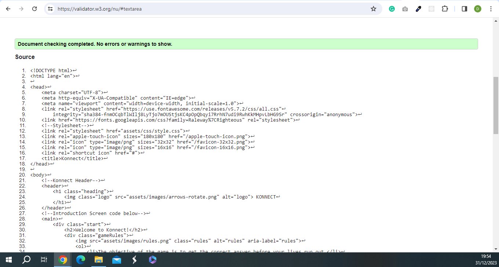

- CSS

  - style.css

    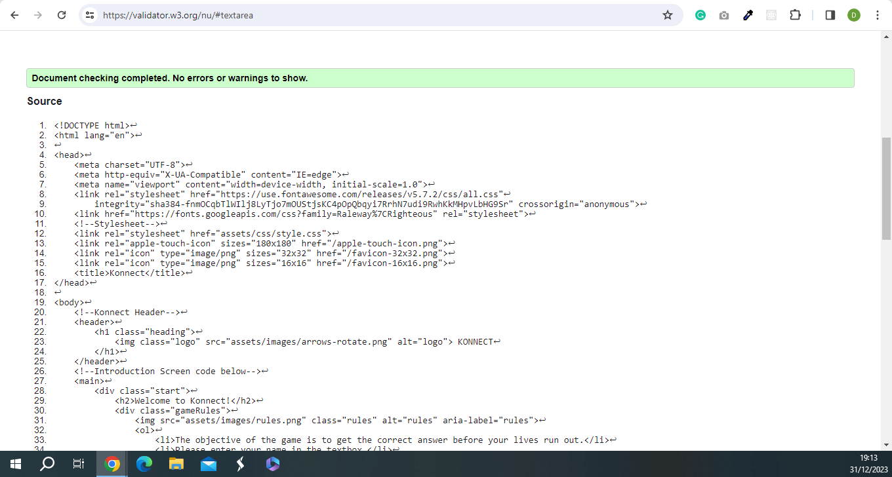

- JAVASCRIPT

  - script.js

  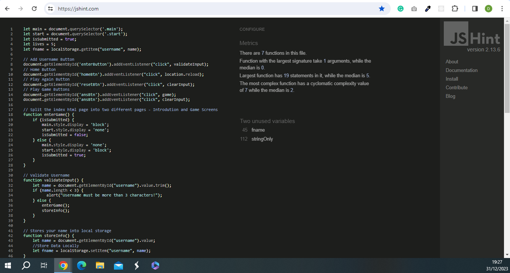

Unfixed Bugs

- Responsiveness of the website worked on all devices and screen sizes

## Deployment

Version Control

Deployment of Live Version from Github

- The website was created using CodeAnyWhere editor and the code was pushed to a repository in GitHub called Konnect.

- I used the following GitHub commands to push the code to the repository, every time a chance is made to the code. This is what they called version control. Its basically a backup version of your code if anything goes wrong.
- git add <file> - This command is basically saving your code
- git commit -m "Commit Message"
- git push

The live link can be found here - <https://firefox35.github.io/konnect/>

Clone the Repository Code Locally

- The site was deployed to GitHub pages. The steps to deploy are as follows:
- In the GitHub repository, navigate to the Settings tab
- From the menu on left select 'Pages'
- From the source section drop-down menu, select the Branch: main
- Click 'Save'
- A live link will be displayed in a green banner when published successfully.

The live link can be found here - <https://firefox35.github.io/konnect/>

Credits

- Links to Images and Content used in the game.

  - Logo Image
    - <https://fontawesome.com/icons/arrows-rotate?f=classic&s=solid>

  - Know the Rule Image
    - <https://www.hubpng.com/photo/63875/rules-and-regulations-icon-clipart-png-follow>

  - Play Again Image
    - <https://icons8.com/icons/set/play-again-button>

  - Home Icon Image
    - <https://icons8.com/icons/set/home-button>

- Learning Material

- Videos

  - Use JavaScript to Get Value from a textbox and display on the page.

    - <https://www.youtube.com/watch?v=aEj0Wu33hJM>

  - Compare Elements of Two Arrays Using for Loop.

    - <https://www.youtube.com/watch?v=On9dzBcNWJk>

  - Compare Two Arrays in JavaScript

    - <https://www.youtube.com/watch?v=xxDqhU-0mek>

  - How to insert text with button click

    - <https://www.youtube.com/watch?v=yZwYuDgfnY4>

  - Saving User Input in JavaScript

    - <https://www.youtube.com/watch?v=96hV2FTg1dU>

  - Compare Objects and Arrays

    - <https://www.youtube.com/watch?v=tx19kr_jfO8>

  - Compare two strings using True or False

    - <https://www.youtube.com/watch?v=zJ7LWiRxxFQ>

  - How to Make input text allow only letters backspace and delete in js
    - <https://www.youtube.com/watch?v=P6bmRQKwxSk>

- Websites

  Stack Over Flow

  - <https://stackoverflow.com/questions/70648133/get-array-data-into-input-fields>
  - <https://stackoverflow.com/questions/2173229/how-do-i-write-a-rgb-color-value-in-javascript>
  - <https://stackoverflow.com/questions/62975985/change-text-color-using-if-else-in-javascript>
  - <https://stackoverflow.com/questions/13628159/split-a-string-into-two-text-boxes>

  Treehouse

  - <https://teamtreehouse.com/community/how-to-create-life-counter>

  Tutorialspoint

  - <https://www.tutorialspoint.com/How-to-limit-the-number-of-characters-allowed-in-form-input-text-field#:~:text=To%20set%20the%20maximum%20character>,use%20minlength%20attribute.

  Ceos3c.com

  - <https://www.ceos3c.com/javascript/store-user-input-in-a-variable-with-javascript/>

  Codingbeautydev.com

  - <https://codingbeautydev.com/blog/javascript-get-first-character-of-string/>

  Developer.mozilla.org

  - <https://developer.mozilla.org/en-US/docs/Web/JavaScript/Guide/Loops_and_iteration>

  Google.com

  - <https://www.google.com/search?rlz=1C1CHBF_enIE1013IE1013&sxsrf=APwXEdfryJ2_ypKt_n4JQstvdsVzFDShAA:1687622045414&q=save+user+input+from+one+function+to+another+javascript&tbm=vid&sa=X&ved=2ahUKEwiGuqCEotz_AhVGhlwKHYU4Bq0Q0pQJegQIChAB&biw=1360&bih=657&dpr=1#fpstate=ive&vld=cid:b4a90358>,vid:7LGpIQ6ceJs

  Freecodecamp.org

  - <https://www.freecodecamp.org/news/javascript-split-how-to-split-a-string-into-an-array-in-js/>

  Programiz.com

  - <https://www.programiz.com/javascript/examples/string-comparison>
