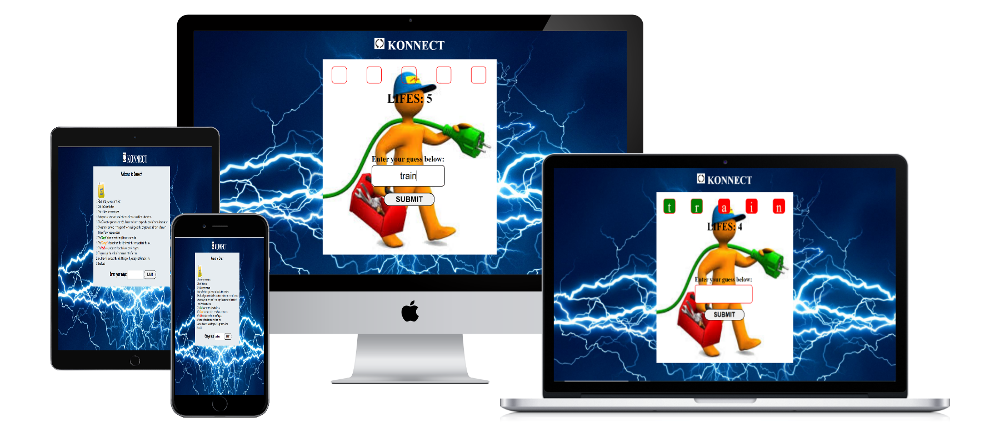
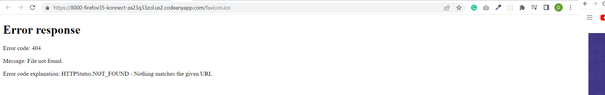
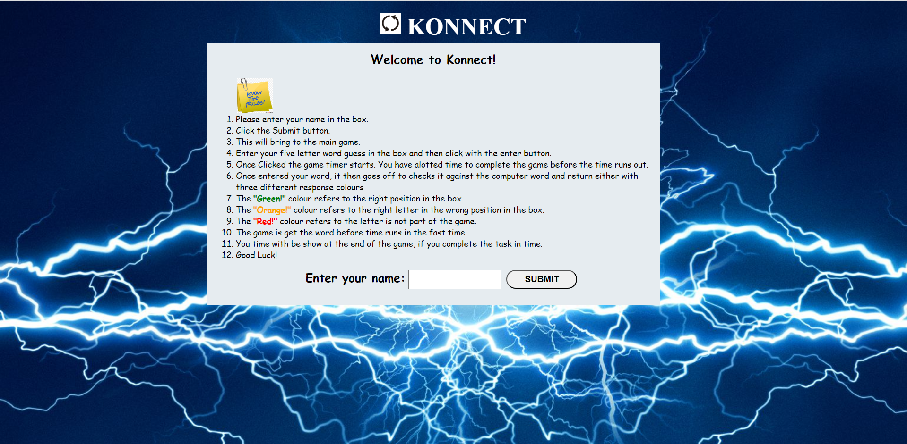
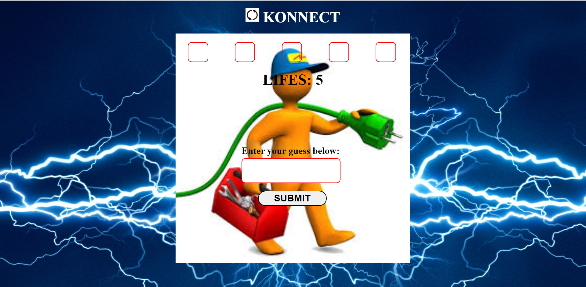
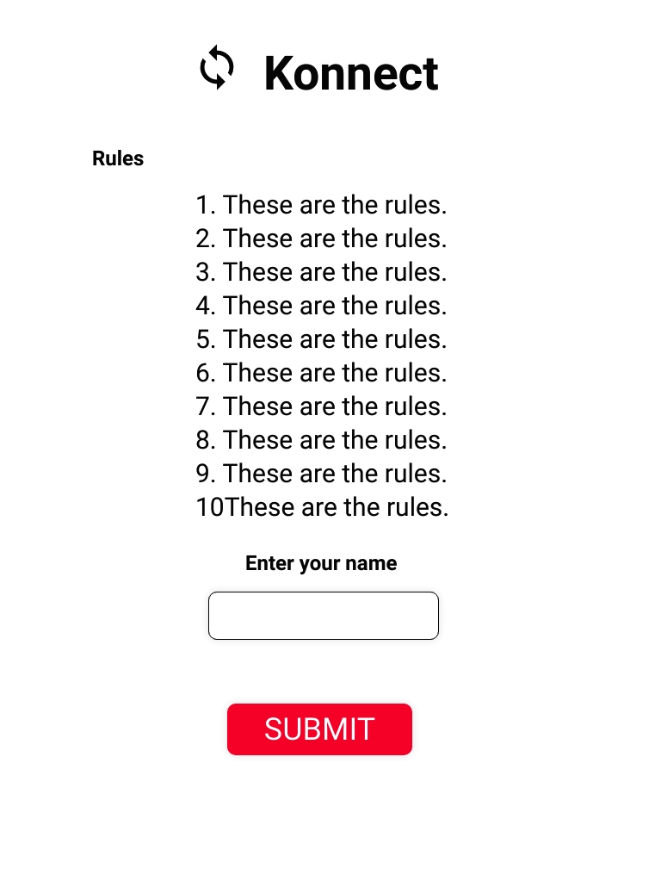
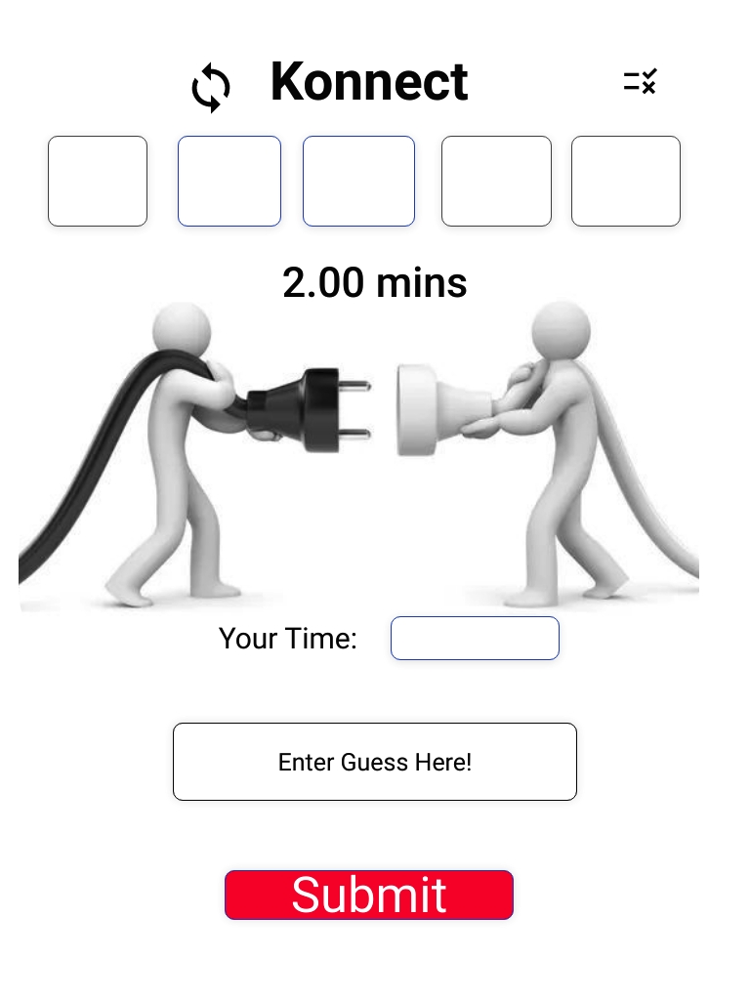
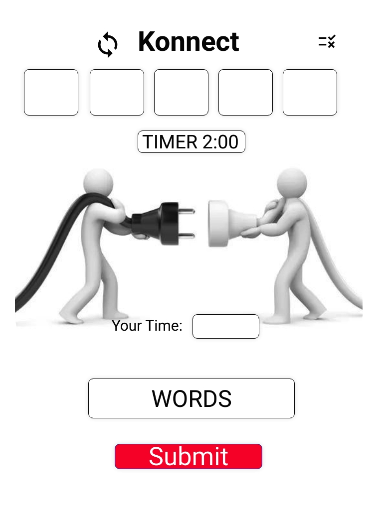
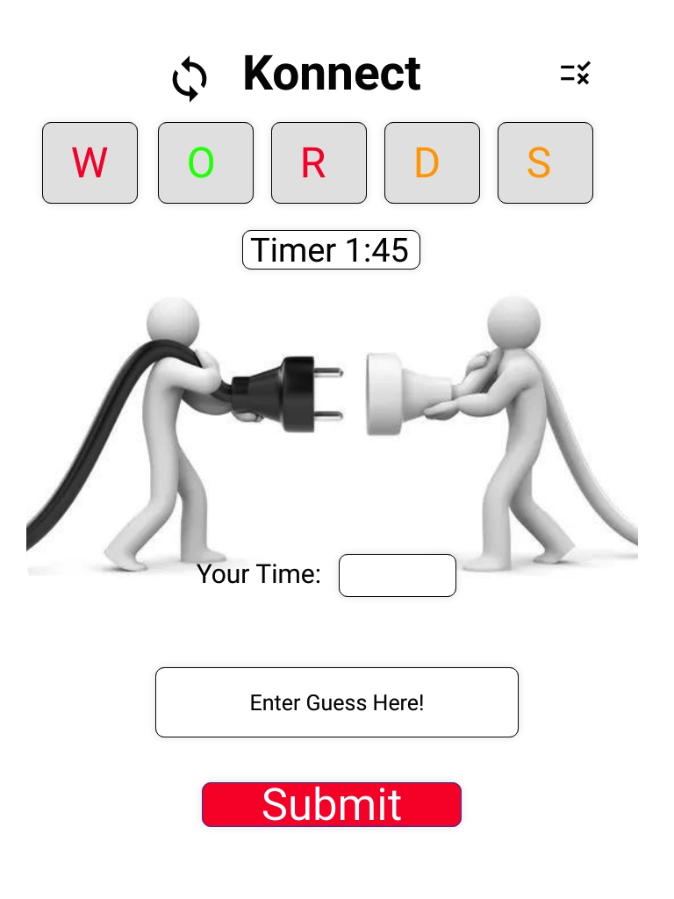
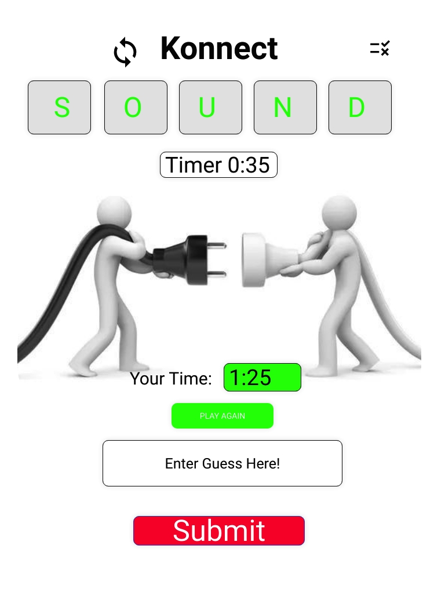

# Konnect

Konnect is a word game where the computer selects a random word and you have to guess the word in the least amount of lifelines. If you get a letter right in the right position of your guess it will turn green, orange shows the letter is right but in the wrong position and red show the letter doesn't belong in the game. This the link to the live version of the game (https://firefox35.github.io/konnect/)

## Features

### Site Wide

Navigation Menu

- The navigation is very simple to the game, once you enter your name into the input field and click submit you will be able to enter the game.
- Once in the game screen its about entering your guess and

Footer

404 Error

- Broken link to page.
- Error due favicon not working.

### About Screen

- About Screen Image

  - The user is shown with an introduction of electricity flowing throught the screen needed to be Konnect to the game.

- About Screen Description
  - The user is shown a screen with general rules of the game and where to enter the person and submit to enter the game.

### Main Game Screen

- Game Screen Image

  - The user is shown with an image of a electrician coming to Konnect to the game as the electricity flows throught the game.

- Game Screen Description
  - The user is displayed with the game as per the game rules shown in the about screen.

## Design

Wireframes - Unizard.io

- About Screen
  

- Main Game Screen
  
  
  
  

## Technologies

HTML

- Hypertext Markup Language is the main language to create the structure of the website.

CSS

- Cascading Style Sheets is used to style your content in an external file.

JavaScript

- Object Oriented programming language that interacts with the web browser.

Github

- This is used to create and store your source code as a backup if you lose your application.
- <https://github.com/firefox35/konnect>

Git

- Git is the language used to submit your source code to the repository.

CodeAnyWhere

- Is the application where you create your website in file structures.

Uizard.io

- This application was used to create mockups for the konnect website.
- <https://app.uizard.io>
- <https://app.uizard.io/prototypes/bMqxdZoEyxTYJrG9RKqP>

Website Mockup Generator

- This application was used to create images of the konnect website in desktop, laptop, tablet and mobile devices.
- <https://websitemockupgenerator.com>

Resize images

-
-

Suppressed Images

-
-

Navigation

-

## Testing

Responsiveness

Steps to test:

1.[Konnect](https://firefox35.github.io/konnect/) 2. 3. 4. 5.

Expected:

Result:

Accessibility

### Lighthouse Testing

About & Main Screen

Functional Testing

Navigation

| Navigation   | Page to Load |
| ------------ | ------------ |
| About Screen | index.html   |
| Main Screen  | index.html   |

- Game Testing

Test 1

- Store Name in Local Storage. - [Konnect](https://firefox35.github.io/konnect/)

Steps to Test:

1. Display of Introduction Screen
2. Enter name in input field
3. The input field shows the name.
4. Click Submit.
5. The user is redirected to the Game Screen
6. The name is stored in local storage,

Expected:

To submit name into local storage.

Result:

No errors and worked as expected.

Test 2

- Nagivate to Game Screen - [Konnect](https://firefox35.github.io/konnect/)

Steps to Test:

1. Display of Introduction Screen
2. Enter name in input field
3. The input field shows the name.
4. Click Submit.
5. The user is redirected to the Game Screen

Expected:

Enter into Game Screen.

Result:

No errors and worked as expected.

Test 3

Steps to Test:
[Konnect](https://firefox35.github.io/konnect/)
Expected:
Result:

Test 4

Steps to Test:
[Konnect](https://firefox35.github.io/konnect/)
Expected:
Result:

Test 5

Steps to Test:
[Konnect](https://firefox35.github.io/konnect/)
Expected:
Result:

Test 6

Steps to Test:
[Konnect](https://firefox35.github.io/konnect/)
Expected:
Result:

Test 7

Steps to Test:
[Konnect](https://firefox35.github.io/konnect/)
Expected:
Result:

Test 8

Steps to Test:
[Konnect](https://firefox35.github.io/konnect/)
Expected:
Result:

- Header Icons/Links

Validation Testing

- HTML
- CSS
- JAVASCRIPT

  Unfixed Bugs

  ## Deployment

  Version Control

  Deployment of Live Version from Github

  The live link can be found here -

  Clone the Repository Code Locally

  Credits

  - Links to Images and Content used in the game.

    - Logo Image

      - https://fontawesome.com/icons/arrows-rotate?f=classic&s=solid

    - Electicity Image

      - https://www.vox.com/2016/9/19/12938086/electrify-everything

    - Know the Rule Image

      - https://www.hubpng.com/photo/63875/rules-and-regulations-icon-clipart-png-follow

    - Stickman Image
      - https://www.facebook.com/ElectricConnectionsAntigua/
      - https://www.presentermedia.com/powerpoint-animation/electrician-plug-it-in-anim-pid-8021

  - Learning Material

    - Videos

      - https://www.youtube.com/watch?v=aEj0Wu33hJM
      - https://www.youtube.com/watch?v=On9dzBcNWJk
      - https://www.youtube.com/watch?v=xxDqhU-0mek
      - https://www.youtube.com/watch?v=yZwYuDgfnY4
      - https://www.youtube.com/watch?v=96hV2FTg1dU
      - https://www.youtube.com/watch?v=tx19kr_jfO8
      - https://www.youtube.com/watch?v=zJ7LWiRxxFQ

    - Websites
      - https://stackoverflow.com/questions/70648133/get-array-data-into-input-fields
      - https://www.ceos3c.com/javascript/store-user-input-in-a-variable-with-javascript/
      - https://www.tutorialspoint.com/How-to-limit-the-number-of-characters-allowed-in-form-input-text-field#:~:text=To%20set%20the%20maximum%20character,use%20minlength%20attribute.
      - https://codingbeautydev.com/blog/javascript-get-first-character-of-string/
      - https://developer.mozilla.org/en-US/docs/Web/JavaScript/Guide/Loops_and_iteration
      - https://stackoverflow.com/questions/2173229/how-do-i-write-a-rgb-color-value-in-javascript
      - https://www.google.com/search?rlz=1C1CHBF_enIE1013IE1013&sxsrf=APwXEdfryJ2_ypKt_n4JQstvdsVzFDShAA:1687622045414&q=save+user+input+from+one+function+to+another+javascript&tbm=vid&sa=X&ved=2ahUKEwiGuqCEotz_AhVGhlwKHYU4Bq0Q0pQJegQIChAB&biw=1360&bih=657&dpr=1#fpstate=ive&vld=cid:b4a90358,vid:7LGpIQ6ceJs
      - https://stackoverflow.com/questions/62975985/change-text-color-using-if-else-in-javascript
      - https://www.freecodecamp.org/news/javascript-split-how-to-split-a-string-into-an-array-in-js/
      - https://www.programiz.com/javascript/examples/string-comparison
      - https://stackoverflow.com/questions/62975985/change-text-color-using-if-else-in-javascript
      - https://stackoverflow.com/questions/13628159/split-a-string-into-two-text-boxes
      - https://teamtreehouse.com/community/how-to-create-life-counter
        -tps://teamtreehouse.com/community/how-to-create-life-counter
      - https://stackoverflow.com/questions/13628159/split-a-string-into-two-text-boxes
